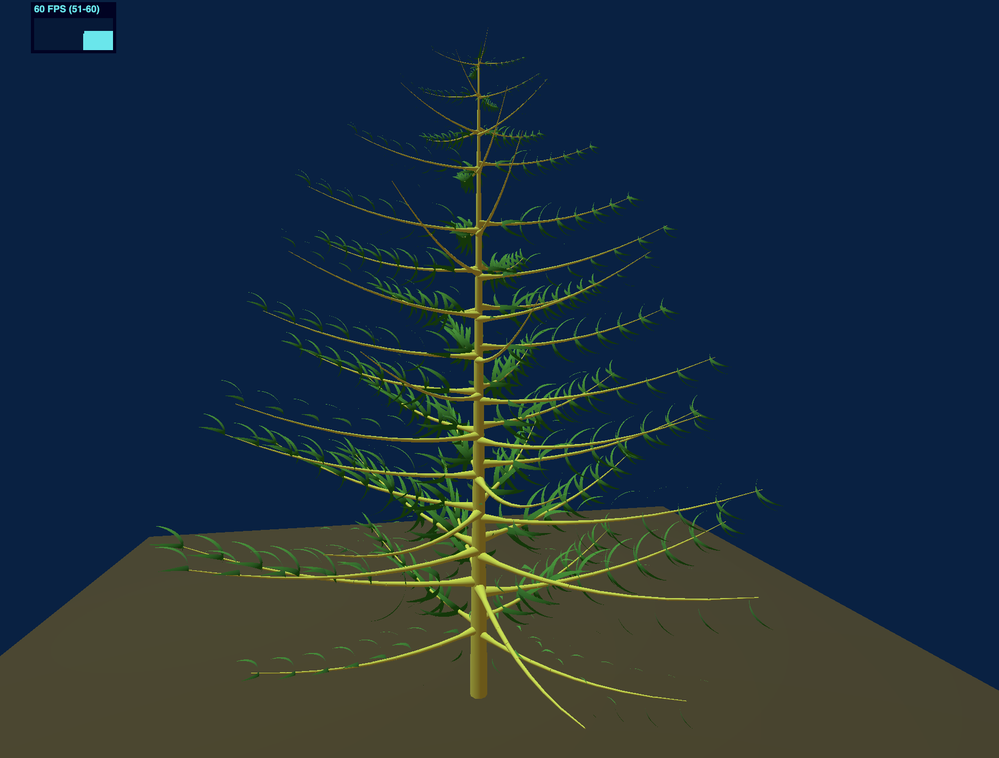
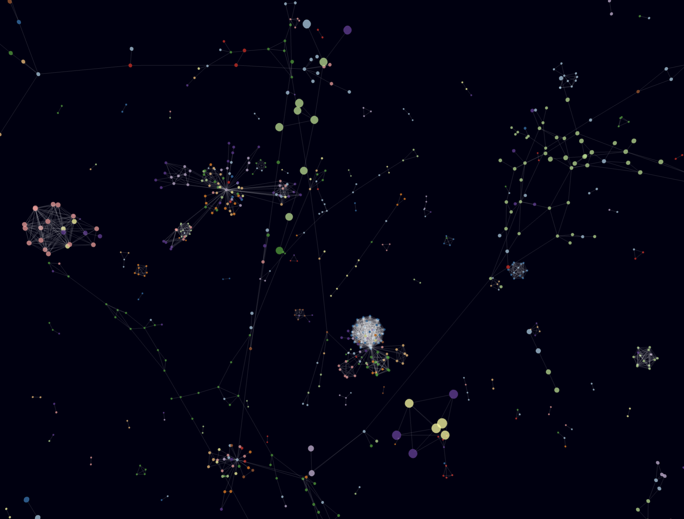

# FusionRender

## Introduction

We introduce FusionRender, a system designed to enhance graphic rendering performance in web browsers by merging graphics rendering and reducing communication overhead.


## Our Renderer

We implement a prototype of FusionRender for Three.js. We use our renderer for the WebGPU rendering process. For the shared aspects of graphics rendering, such as classes representing three-dimensional graphics, cameras, and lighting, we integrated code from three.js. We can apply a similar integration approach to replace the renderer and seamlessly incorporate it with our system for other frameworks, as most graphics rendering frameworks have the same key components.

### Setup

The codes are located in `./src/three.js-fusionrender`. To access them, navigate to the directory using the following command:

```bash
cd ./src/dev
```

Once you're in the `./src/three.js-fusionrender` directory, install the required dependencies using npm:

```bash 
npm install
```

### Usage

After installing the dependencies, you can run the project using the following command:

```bash
npm run dev
```

After starting the project, you can find the access URL in the terminal logs. It will be similar to:

```bash
Server running at: https://localhost:8080
```

You can access the application by navigating to this URL in your web browser.

Upon opening the URL, you will see a directory listing. Click on the `examples` directory to view multiple HTML files. Each HTML file represents a different application. Click on the HTML file corresponding to the application you want to explore to launch it.

### Examples

For those interested in exploring specific examples, they are located in the `./examples` directory. 

### Code Changes

If you wish to delve into the main changes made to the codebase, you can find them in the following files:

* ./examples/jsm/renderers/common/Renderer.js
* ./examples/jsm/renderers/WebGPU/WebGPUBackend.js

These files contain the core modifications implemented for FusionRender within the Three.js framework.

## Simulated Evaluation

We conduct simulated experiments to test the performance of FusionRender under varying levels of scene complexity. We progressively increase the number of rendered cubes and measure the performance of FusionRender as well as existing framework. 

### Baseline Setup

The baseline codes are located in the simulated directory. Use the following command to enter the directory in your terminal:

```bash
cd simulated
```

To run the baseline measurements, you need to set up a local server. You can use tools like http-server to do this. Install http-server globally if you haven't already:

```bash
npm install -g http-server
```

Then, start the server in the simulated directory:

```bash
http-server -c-1
```

This command starts a server with caching disabled (-c-1).

Once the server is running, access the provided URL in your web browser. You can then click on the corresponding HTML file to open it and begin the baseline measurements.

### Measurement

After setting up the local server and navigating to the simulated directory, you can access the measurement scripts for each baseline framework:

* Three.js: measureThree
* Babylon.js: measureBabylon
* PlayCanvas: measurePlaycanvas
* Orillusion: measureOrillusion

Each framework has HTML files (multicube-webgl.html and multicube-webpu.html) for measuring performance using WebGL and WebGPU, respectively.

After setting up the local server, navigate to the corresponding directory where the HTML files are located using your web browser.

Click on the HTML files (multicube-webgl.html or multicube-webpu.html) to open them. These files contain the measurement scripts for each framework.

While running the measurements, you can open the HTML files locally on your machine to view the code and understand how each framework is implemented.

For FusionRender, you can find the code for the simulated experiments in the `./src/three.js-fusionrender/examples/A-multicube-WebGPU.html` file. To run these experiments, follow the same setup process as described in the "Our Renderer" section.

You can adjust the number of rendered cubes by modifying the `edgeNum` and `total` parameters in the HTML files. To view the measurement results, open the web developer tool and navigate to the console. The FPS (frames per second) will be logged there.


## Real Case Study

In order to explore the performance of FusionRender in real-world scenarios with more advanced functionality and complex scenes. The examples were initially designed for Three.js-WebGL. We made minor adjustments to make them compatible with Three.js-WebGPU and FusionRender.


### [PinusTree](https://jrlazz.eu5.org/anim/pinus_noSh.html)

PinusTree renders a pine tree composed of a hierarchical graphics structure, with larger sub-graphics encompassing smaller ones. Computing the positions of these graphics necessitates hierarchical calculations involving varying matrix multiplications, demanding more CPU computations. Additionally, it incorporates point and ambient lighting, comprising 1 Plane, 60 Boxes, 541 Cylinders, and 481 clusters of leaves, where each cluster is formed by merging eight spheres into a single graphic.



#### Usage

Baseline versions of PinusTree, based on WebGL and WebGPU, are respectively located in the following directories:

* /realCase/pinus-tree-webgl

* /realCase/pinus-tree-webgpu

To run these baseline versions, navigate to the respective directory, set up a local server, and access the HTML file named `pinus_noSh.html` in your web browser.

The FusionRender version of PinusTree's code is located in `./src/three.js-fusionrender/examples/A-pinus-tree-fusionrender.html`. Similarly, to run the FusionRender version, navigate to the directory, set up a local server, and access the HTML file in your web browser.

Once the application is running, you can check the performance in the web developer tools.

### [ForceGraph](https://github.com/vasturiano/3d-force-graph/tree/master)

ForceGraph Draws force-directed graphs involves points and edges, where the distance between points and the magnitude of forces between them are related. A more randomized distribution of graphics may lead to increased cache misses during GPU rendering. The graph consists of 8000 spheres and 7999 cylinders.



#### Setup

Baseline versions of ForceGraph, based on WebGL and WebGPU, as well as the FusionRender version, are respectively located in the following directories:

* ./realCase/3d-force-graph-webgl
* ./realCase/3d-force-graph-webgpu
* ./realCase/3d-force-graph-fusionrender

Enter the directory of the version you want to use. For example, for the WebGPU version:

```bash
cd ./realCase/3d-force-graph-webgpu
```

Run the following command to install dependencies:

```bash
npm install
```

Replace the `three-forcegraph` and `three-render-objects` folders in the `node_modules` directory with the ones located in `node_module` directory.

Run the following command to build the project:

```bash
npm build
```

#### Usage

Use a tool like http-server to set up a local server in the directory.

Once the server is running, open the example/A-fit-to-canvas.html file in your web browser.

Once the application is running, you can check the performance in the web developer tools.


### [BubblePose](https://github.com/wunderdogsw/go-23-app)

BubblePose Renders graphics based on the coordinates of the human body’s skeleton. The graphics are structured hierarchically, and hierarchical calculations for graphics positions involve more CPU computation compared to simulation experiments. It includes 6451 Spheres.


#### Setup

Baseline versions of BubblePose, based on WebGL and WebGPU, as well as the FusionRender version, are respectively located in the following directories:

* ./realCase/bubble-pose-webgl
* ./realCase/bubble-pose-webgpu
* ./realCase/bubble-pose-fusionrender

Enter the directory of the version you want to use. For example, for the WebGPU version:

```bash
cd ./realCase/bubble-pose-webgpu
```

Run the following command to install dependencies:

```bash
npm install
```

#### Usage

Run the following command to start the application:

```bash
npm run dev
```

Once the application is running, open the URL displayed in the terminal in your web browser. You can check the performance in the web developer tools.


