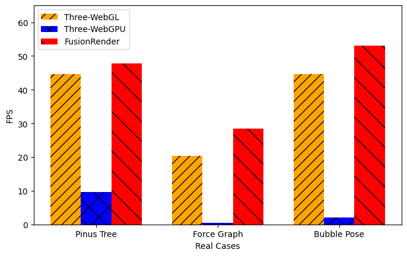

# FusionRender

## Introduction

We introduce FusionRender, a system designed to enhance graphic rendering performance in web browsers by merging graphics rendering and reducing communication overhead.

During the rendering process, FusionRender initially groups objects and consolidates the rendering of graphics within the same group, thereby reducing the frequency of CPU-to-GPU communication. To determine which objects can be merged, FusionRender analyzes each object and assigns a signature. Subsequently, signatures with the same hash value are identified, enabling the grouping of graphics based on their signatures. Graphics within the same
group are then rendered using the same rendering pipeline.

When rendering the group of objects together, the data is concatenated and transmitted to the GPU. To ensure that the data required for each graphic’s rendering is accessible after merging, FusionRender employs instance indices to track individual objects. Building upon the abovementioned method, we have considered dividing the merge operations into several batches for submission.

## Our Renderer

We implement a prototype of FusionRender for Three.js. We use our renderer for the WebGPU rendering process. For the shared aspects of graphics rendering, such as classes representing three-dimensional graphics, cameras, and lighting, we integrated code from three.js. We can apply a similar integration approach to replace the renderer and seamlessly incorporate it with our system for other frameworks, as most graphics rendering frameworks have the same key components.

The codes are located in `./src/dev`. Using `npm run dev` to start. See examples in `./examples`. The main changes are located in `./examples/jsm/renderers/common/Renderer.js` and `./examples/jsm/renderers/WebGPU/WebGPUBackend.js`.

## Simulated Evaluation

We conduct simulated experiments to test the performance of FusionRender under varying levels of scene complexity. We progressively increase the number of rendered cubes ([512, 1024, 2048, 4096, 8192, 16384, 32768]) and measure the performance of FusionRender as well as existing framework. The results are illustrated as follows.

In simulated experiments, FusionRender demonstrates a median rendering performance improvement of 29.3%-122.1% compared to the existing optimal baseline.

The codes of baselines are located in `simulated`. `measureThree`, `measureBabylon`, `measurePlaycanvas`, `measureOrillusion` contains code for measuring Three.js, Babylon.js, PlayCanvas, and Orillusion,  respectively. For each of them, `multicube-webgl.html` measure performance of WebGL, and `multicube-webpu.html` measure performace of WebGPU. The measurement of FusionRender can be done by `./src/dev/examples/A-multicube-webgpu.html`. The FPS will be logged to the web developer tool.

## Real Case Study

In order to explore the performance of FusionRender in real-world scenarios with more advanced functionality and complex scenes, we compared FusionRender, Three.js-WebGL, and Three.js-WebGPU. We selected examples from the Three.js Forum posted last year, focusing on open-source examples with performance issues on mobile devices and excluding those with custom GLSL shaders.

The cases used are as follows:

* [PinusTree](https://jrlazz.eu5.org/anim/pinus_noSh.html): Rendering a pine tree composed of a hierarchical graphics structure, with larger sub-graphics encompassing smaller ones. Computing the positions of these graphics necessitates hierarchical calculations involving varying matrix multiplications, demanding more CPU computations. Additionally, it incorporates point and ambient lighting, comprising 1 Plane, 60 Boxes, 541 Cylinders, and 481 clusters of leaves, where each cluster is formed by merging eight spheres into a single graphic.

* [ForceGraph](https://github.com/vasturiano/3d-force-graph/tree/master): Drawing force-directed graphs involves points and edges, where the distance between points and the magnitude of forces between them are related. A more randomized distribution of graphics may lead to increased cache misses during GPU rendering. The graph consists of 8000 spheres and 7999 cylinders.

* [BubblePose](https://github.com/wunderdogsw/go-23-app): Rendering graphics based on the coordinates of the human body’s skeleton. The graphics are structured hierarchically, and hierarchical calculations for graphics positions involve more CPU computation compared to simulation experiments. It includes 6451 Spheres.

These examples were initially designed for Three.js-WebGL. We made minor adjustments to make them compatible with Three.js-WebGPU and FusionRender. Moreover, we remove components for neural network inference and focus solely on rendering. Throughout this modification process, we ensured the examples remained consistent across the three comparative frameworks.

The results are illustrated as follows:

The codes are located in `./realCase` and `./src/dev/examples/A-pimus-noSh-our.html`. The baselines of WebGL and WebGPU end with `-webgl` and `-webgpu`, and the code of FusionRender end with `-our`. For Force Graph, replace three node modules with the changed ones provided in the `node_module` folder before starting.

